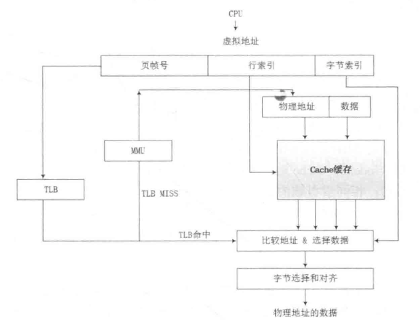
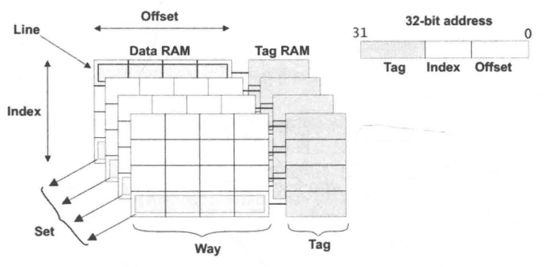

___this file is for 奔跑把linux内核总结___

##  第一章 处理器架构
1.  请简述精简指令集RISC和复杂指令集CISCO的区别。   
    20世纪70年代，IBM的John发现，处理器提供了大量指令集和复杂寻址方式并不会被编译器生成的代码用到：20%的简单指令经常被用到，占程序总指令数的80%，而指令集其余80%的复杂指令很少被用到，只占程序总指令数的20%，给予这种思想，将指令集和处理器进行重新设计，在新的设计中只保留了常用的简单指令，这样处理器不需要浪费太多晶体管去做那些复杂又很少使用的复杂指令。通常，简单指令大部分时间都能在一个cycle内完成，基于这种思想的指令集叫做RISC(Reduced Instruction Set Computer)指令集，以前的指令集叫做CISC(Complex Instruction Set Computer)指令集。   
    IBM和David、John是研究RISC研究的先驱，Power处理器来自IBM，ARM/SPARC处理器受到伯克利RISC的影响，MIPS来自斯坦福。当下还在是用的最出名的CISCO指令集是Intel/AMD的x86指令集。 
    RISC处理器通过更合理的微架构在性能上超越了当时传统的CSIC处理器，在再最初的较量中，Intel处理器败下来，服务器市场的处理器大部分被RISC阵营占据。Intel的David和他的同事一起设计了Pentium Pro处理器，x86指令集被解码成类似RISC指令的微操作指令，以后执行的过程采用RISC内核的方式。CISCO这个古老的架构通过巧妙的设计，又一次焕发生机，Intel的x86处理器的性能逐渐超过同期的RISC处理器，抢占了服务器市场，导致其他的处理器厂商只能向低功耗或者嵌入式方向发展。  
    RISC在思想上更加先进。Intel的CSIC的指令集向前兼容，打败所有的RISC厂商。不过在手机移动业务方面，以ARM为首的厂商占得先机。  
2.  请简述数值0x12345678在大小端字节序处理器的存储中的存储方式。  
    在计算机系统中是以字节为单位的，每个地址单元都对应着一个字节，一个字节为8个比特位。但是在32位处理器中，C语言中除了8比特的char类型之外，还有16比特的short类型，32位bit的int类型。另外对于位数大于8位的处理器，例如16位或者32位的处理器，由于寄存器大于一个字节，那么必然存在这如何安排多个字节的问题，因此导致了大端存储模式和小端存储模式。例如一个16比特的short型变量X，在内存中的地址为0x0010，X的值为0x1122，那么0x11位高字节，0x22位低字节。对于大端模式，就将0x11放在低地址；0x22放在高地址 中。小段模式则刚好相反。很多ARM处理器默认是用小端模式，有些ARM处理器还可以由硬件来选择是小端模式还是大端模式。Cortex-A系列的处理器可以通过软件来配置大小端模式。大小端模式是在处理器Load/Store访问内存时用于描述寄存器的字节序和内存中的字节序之间的关系。  
    大端模式：指数据的高字节保存在内存的低地址中，而数据的低字节保存在内存的高地址中。例如：  
       
    在大端模式下，前32位：12 34 56 78.  
    因此，大端模式下地址的增长顺序与值的增长顺序相同。  
    小端模式：指数据的高字节保存在内存的高地址中，而数据的低字节保存在内存的低地址中，例如：  
      
    因此，小端模式下地址的增长顺序与值的增长顺序相反。
    如何检查处理器是大端模式还是小端模式？联合体Union的存放顺序是所有成员都从低地址开始存放的，利用该特性可以轻松获取CPU对内存采用大端模式还是小端模式读写。   
    ```
    int check_cpu(void) {
      union w {
        int a;
        char b;
      } c;
      c.a = 1;

      return (c.b == 1);
    }
    ```
    如果输出结果是true，则是小端模式，否则是大端模式。    
3.  请简述在你所熟悉的处理器（比如双核Cortex-A9）中一条存储读写指令的执行全过程。   
    经典处理器架构的流水线是五级流水线：取指、译码、发射、执行、写回。  
      现代处理器在设计上都采用了超标量体系结构和乱序执行技术，极大地提高了处理器计算能力。超标量技术能够在一个时钟周期内执行多个指令，实现指令级的并行，有效提高了ILP指令级的秉性效率，同也增加了整个cache和memory层次结构的实现难度。  
    一条存储读写指令的执行全过程很难用一句话来回答，在一个支持超标量和乱序执行技术的处理器当中，一条存储读写指令的执行过程被分解为若干步骤。指令寿险进入流水线的前端，包括预取和译码，经过分发和调度后进入执行单元，最后提交执行结果。所有的指令采用顺序方式通过前段，并采用乱序的方式进行发射，然后乱序执行，最后用顺序的方式提交结果，并将最终结果更新到LSQ部件。LSQ部件是指令流水线的一个执行部件，可以理解为存储子系统的最高层，其上接收来自CPU的存储器指令，其下连接着存储器的子系统。其主要功能是将来自CPU的存储器请求发送到存储器子系统，并处理其下存储器子系统的应答数据和消息。  
    很多程序员对乱序执行的理解有误差。对于一串给定的指令序列，为了提高效率，处理器会找出非真正数据以来和地址以来的指令，让他们并行执行。但是在提交执行结果的时候，是按照指令次序的。总的来说，顺序提交指令，乱序执行，最后顺序提交结果。例如有两条没有数据以来的数据指令，后面那条指令的读数据先被返回，它的结果也不能先回写到最终寄存器，而是必须等到前一条指令完成之后才可以。  
    对于读指令，当处理器在等待数据从缓存或者内存返回时，他处于什么状态呢？是等在那不动个，还是继续执行别的命令？对于乱序执行的处理器，可以执行后面的指令；对于顺序执行的处理器，会使流水线停顿，直到读取的数据返回。  
    如图所示，在x86微处理器经典架构中，存储指令从L1指令cache中读取指令，L1指令cache会做指令加载、指令预取、指令预解码、以及分支预测、然后进入取指、译码单元，会把指令解码成macro-ops微操作指令。然后由dispatch部件分发到Integer Unit或者FloatPoint Unit。Integer Unit由Integer Scheduler和Execution Unit组成，Execution Unit包含算数逻辑单元（ALU）和地址生成单元（AGU），在ALUM计算完成之后进入AGOU，计算有效地址完毕后，将结果发送到LSQ部件中，LSQ部件寿险根据处理器系统要求的内存一致性模型确定访问时序。另外LSQ还需要处理存储器指令间的依赖关系，最后LSQ需要准备L1 cache是用的地址，包括有效地址的计算和虚实地址转换，将地址发送到L1 Data Cache中。  
        
    如图所示，在ARM Cortex-A9处理器中，存储指令首先通过主存储器或者L2 cache加载到L1指令cache中。在指令预取阶段，主要是做指令预取和分支预测，然后指令通过Instruction Queue队列被送到解码器进行指令的解码工作。解码器支持两路解码，可以同事解码两条指令。在寄存器重命名阶段会做寄存器重命名，避免及气质听不必要的顺序化操作，提高处理器的指令级秉性能力，在指令分发阶段，这里支持4路猜测发射和乱序执行，然后再执行单元中乱序执行。存储指令会计算有效地址并发射到内存系统中的LSU部件，最终LSU部件会访问L1数据cache。在ARM中，只有cacheable的内存地址才需要访问cache。   
        
    在多处理器环境下，还要考虑Cache的一致性问题。L1和L2 Cache控制器需要保证擦车的一致性，在Cortex-A9中，cache的一致性是由MESI协议来实现的。Cortex-A9处理器内置了L1 Cache模块，由SCU单元来实现Cache的一致性管理。L2 Cache需要外界芯片。在最糟糕情况下需要访问主存储器，并将数据重新传递给LSQ，完成一次存储器读写的全过程。   
    部分术语简单解释：  
    +  超标量体系结构：早起的弹发射结构微处理器的流水线设计目标是做到每个周期能平均执行一条指令，但是这一目标不能满足处理器性能增长的要求，为了提高处理器的性能，要求处理器具有每个周期能发射执行多条指令的能力。因此超标量体系结构是描述一种微处理器设计理念，它能够在一个始终周期执行多个指令。  
    +  乱序执行：指CPU采用了允许将多条指令不按照程序规定的顺序分开发送给各个相应电路单元处理的技术，避免处理器在计算对象不可获取时的等待，从而导致流水线停顿。  
    +  寄存器重命名：现代处理器的一种技术，用来避免机器指令或者微操作的不必要的顺序化执行，从而提高处理器的指令级并行的能力。它在乱序执行的流水线中有两个作用，一是消除指令之间的寄存器读后写相关和写后写相关。二是当指令执行发生例外或者转移指令猜测错误而取消后面的指令时，可用来保证现场的精确。其思路时当一条指令写一个结果寄存器时不直接写到这个结果寄存器，二是先写到一个中间寄存器过渡，当这条指令提交时再写到结果寄存器中。  
    +  分支预测：当处理一个分支指令时，有可能会产生跳转，从而打断流水线执行的处理，因为处理器无法确定该指令的下一条指令，知道分支指令执行完毕。流水线越长，处理器等待时间便越长，分支预测技术就是为了解决这一问题而出现的。因此分支预测时处理器在程序分支执行前预测其结果的一种机制。在ARM中，是用全局分支预测器，该预测器由转移目标缓冲器、全局历史缓冲器、MicroBTB，以及Return Stack组成。  
    +  指令译码器：指令由操作码和地址码组成。操作码表示要执行的操作性质，即执行什么操作；地址码时操作码执行时的操作对象的地址。计算机执行一条指定的指令时，必须首先分析这条指令的操作码是什么，以决定操作的性质和方法，然后才能控制计算机其他各个部件协同完成指令表达的功能，这个分析工作由译码器来完成。例如Cortex-A57可以支持3路译码器，即同事执行3跳指令译码，而Cortex-A9处理器只能同时执行2跳指令。  
    +  调度单元：调度器负责把指令或者微操作指令派发到相应的执行单元去执行，例如，Cortex-A9处理器的调度器单元由4个接口和执行单元链接，因此每个周期可以同时派发4条指令。  
    +  ALU算数逻辑单元：ALUM是处理器的执行单元，主要是进行算数运算，逻辑运算和关系运算的部件。  
    +  LSQ/LSU部件：LSQ部件是指令流水线的一个执行部件，其主要功能是将来自CPU的存储器子系统的应答数据和消息。    
4.  请简述内存屏障产生的原因。  
    程序在运行时的实际内存访问顺序和程序代码飙血的访问顺序不一致，会导致内存乱序访问。内存乱序访问的出现是为了提高程序运行时的性能。内存乱序访问主要发生在如下两个阶段：  
    +  编译时，编译器优化导致内存乱序访问。   
    +  运行时，多CPU间交互引起的内存乱序访问。  
    编译器会把符合人了isi考的逻辑代码（例如C语言）翻译成CPU运算规则的汇编指令，编译器了解底层CPU的思维逻辑，因此他会在翻译成汇编时进行优化。例如内存访问指令的重新排序，提高指令级秉性效率。然而，这些优化可能会违背程序员原始的代码逻辑导致发生一些错误。编译时的乱序访问可以通过volatile关键字来规避。  
    ```
    #define barrier() __asm__ __volatile__("" ::: "memory")
    ```
    `barrier()`函数告诉编译器，不要为了性能优化而将这些代码重新排序。   
    由于现代处理器普遍采用超标量技术、乱序发射以及乱序执行等技术来提高指令级并行的效率，因此指令的执行序列在处理器的流水线中有可能被打乱，与程序代码编写时序列的不一致。另外现代处理器采用多级存储结构，如何保证处理器对存储子系统访问的正确性也是一大挑战。  
    例如，在一个系统中有n个处理器$P_{1}$~$P_{n}$，假设每个处理器包含$S_{i}$个存储操作，那么从全局来看可能的存储器访问序列有多重组合。为了保证内存访问的一致性，需要按照某种规则来选出合适的组合。为了保证这个规则叫做内存一致性模型。这个规则需要保证正确性的前提，同时也要保证多处理器访问较高的并行度。  
    在一个单核处理器系统中，访问内存的正确性比较简单。每次存储器度操作所获得的结果时最近写入的结果，但是在多处理器并发访问存储器的情况下就很难保证正确性了。我们很容易想到是用一个全局时间比例部件来决定存储器访问时序，从而判断最近访问的数据，这种内存一致性访问模型是严格一致性内存模型，也称为Atomic Consistency。全局时间比例方法实现的代价比较大，那么退而求其次，采用每个处理器的本地时间比例部件的方法来确定最新数据的方法被称为顺序一致性内存模型。处理器一致性内存模型时进一步弱化，仅仅要求来自同一个处理器的写操作具有一致性的访问杰克。  
    以上这些内存一致性模型时针对存储器读写指令展开的，还有一类目前广泛是用的模型，这些模型是用内存同步指令，也称为屏障指令。在这种模型下，存储器访问指令被分割为数据指令和同步指令两大类，若一致性内存模型就是给予这种思想。  
    1986年，Dubois等发表的论文描述了弱一致性内存模型的定义：  
    +  对同步变量的访问是顺序一致的。   
    +  在所有之前的写操作完成之前，不能访问同步变量。   
    +  在所有之前同步变量的访问完成之前，不能访问（读或者写）数据。   
    弱一致性内存模型要求同步访问是顺序一致的，在一个同步访问可以被执行之前，所有之前的数据访问必须完成。在一个正常的数据访问可以被执行之前，所有之前的同步访问必须完成，这实质上把一致性问题留给了程序员来决定。  
    ARM的Cortex-A系列处理器实现了弱一致性内存模型，同事也提供了3跳内存屏障指令。  
5.  ARM有几条Memory barrier的指令？分别有什么区别？   
    从ARMv7指令集开始，ARM提供3跳内存屏障指令。   
    +  数据存储屏障(Data Memory Barrier, DMB)  
       数据存储隔离，DMB指令保证：仅当所有在它前面的存储器访问操作都执行完毕后，才提交在他后面存取访问操作指令。当位于此指令钱的所有内存访问军完成时，DMB指令才会完成。 
    +  数据同步屏障(Data synchronization Barrier, DSB)  
       数据同步隔离，比DMB要严格一些，仅当所有在它前面的存储访问操作指令都执行完毕后，才会执行在它后面的指令，即任何指令都要等待DSB前面的存储访问完成。位于此指令前的所有缓存，如分支预测和TLB(Translation Look-aside Buffer)维护操作全部完成。  
    +  指令同步屏障(Instruction synchronization Barrier, ISB)   
       指令同步隔离。它最严格，冲洗流水线和预取buffers后，才会从cache或者内存中预取ISB指令之后的指令，ISB通常用来保证上下文切换的效果，例如更改ASID（Address Space Identifier）、TLB维护操作和C15寄存器的修改等等。   
    内存屏障指令使用例子：    
    eg1:假设有两个CPU核A、B，同时访问Addr1，和Addr2。 
    ```
    Core A:
      STR R0, [Addr1]
      LDR R1, [Addr2]

    Core B:
      STR R2, [Addr2]
      LDR R3, [Addr1]
    ```
    对于上面的代码片段，没有任何的同步措施。对于Core A、寄存器R1、Core B和寄存器R3，可能得到如下结果：  
    +  A得到旧的值，B也得到旧的值。 
    +  A得到旧的值，B得到新的值。 
    +  A得到新的值，B得到旧的值。 
    +  A得到新的值，B得到新的值。 
    eg2:假设CoreA写入新数据到Msg地址，CoreB需要判断flag标识后才能读入新数据。   
    ```
    Core A:
      STR R0, [Msg] @写新数据到Msg地址
      STR R1, [Flag] @Flag标识新数据可以度

    Core B:
      Poll_loop:
        LDR R1, [Flag]
        CMP R1, #0 @判断flag有没有置位
        BEQ Poll_loop
        LDR R0, [Msg] @读取新数据
    ```
    在上面的代码片段中，CoreB可能读不到最新数据，因为CoreB可能因为乱序执行的原因先读入Msg，然后读取Flag。在弱一致性内存模型中，处理器不知道Msg和Flag存在数据依赖性，所以程序员必须是用内存屏障指令来显式地告诉处理器这两个变量有数据以来关系。CoreA需要在两个存储指令之间插入DMB指令来保证两个store存储指令的执行顺序。CoreB需要在“LDR R0, [Msg]”之前插入DMB指令来保证直到flag置位后才读入Msg。   
    eg3: 在以恶搞设备驱动中，写入一个命令到一个外设寄存器中，然后等待状态的变化。   
    ```
    STR R0, [Addr] @写一个命令到外设寄存器
    DSB
    Poll_loop:
      LDR R1, [Flag]
      CMP R1, #0 @等待状态寄存器的变化
      BEQ Poll_loop
    ```
    在STR存储指令之后插入DSB指令，强制让命令完成，然后执行读取Flag的判断循环。  
6.  请简述cache的工作方式。   
    处理器访问主存储器是用地址编码方式。cache也是用类似的编码方式，因此处理器是用这些编码地址可以访问各级cache。如图所示：  
         
    处理器在访问存储器时，会把地址同时传递给TLB（Translation Lookaside Buffer）和cache。_TLB时一个用于存储虚拟地址到物理地址转换的小缓存_，处理器先是用EPN（effective page number），在TLB中进行查找最终的RPN（Real Page Number）。如果这期间发生TLB miss，将会带来一系列严重的系统惩罚，处理器需要查询页表。假设这里TLB hit，此时很快获得何时的RPN，并得到相应的物理地址（Physical Address，PA）。    
    同事，处理器通过cache编码地址的索引域（cache line index）可以很快找到相应的cache line 组。但是这里的cache block的数据不一定是处理器所需要的，因此有必要进行一些检查，将cache line中存放的地址和通过虚实地址转换得到的物理地址进行比较。如果相同并且状态位匹配，那么就会发生cache命中（cache hit），那么处理器经过字节选择和便宜（Byte Select and Align）部件，最终就可以获取所需要的数据。如果发生cache miss，处理器需要用物理地址进一步访问主存储器来获得最终数据，数据也会填充到相应的cache line。上述描述的时VIPT(virtual index physical tag)的cache组织方式。   
    如图所示，是cache的基本的结构图。   
       
    +  cache地址编码：处理器访问cache时的地址编码，分成三个部分，分别时偏移域(offset)、索引域(index)、标记域(tag)。   
    +  cache line: cache中最小的访问单元，包含一小段主存储器中的数据，常见的cache line大小时32 bytes或者64 bytes等等。   
    +  索引域(index)：cache地址编码的一部分，用于索引和查找是在cache中的哪一行。    
    +  组(set): 相同索引域的cache line组成一个组。  
    +  路(way)：在组相连的cache中，cache被分成大小相同的几个块。  
    +  标记(tag)：cache地址编码的一部分，用于判断cache line存放的数据是否和处理器想要的一致。   
7.  cache的映射方式有full-associative（全关联）、direct-mapping（直接映射）和set-associative（组项链）3中方式，请简述他们之间的区别。为什么现代的处理器都是用组相连的cache映射方式？  
    +  直接映射   
       根据每个组(set)的告诉缓存行数，cache可以分成不同的类。当每个组只有一行cache line时，称为直接映射告诉缓存。   
       如图所示，下面用衣蛾简单小巧的cache来说明，这个cache只有4行cache line，每行有4个字（word，一个字时4个bate），共64bytes。这个cache控制器可以是用两个比特位（bits[3:2]）来选择cache line中的字，以及是用另外两个比特位（bits[5:4]）作为索引（index），选择4个cache line中的一个字，其余的比特位用于存储标记值（tag）。    
       在这个cache中查询，当索引域和标记域的值和查询的地址相等，并且有效位显示这个cache line包含有效数据时，则发生cache命中，那么可以是用偏移域来寻址cache line中的数据。如果cache line包含有效数据，但是标记域时其他地址的值，那么这个cache line需要被替换。因此在这个cache中，主存储器中所有bit[5:4]相同值的地址都会映射到同一个cache line中，并且同一时刻再有衣蛾cache line，因为cache line被频繁换入患处，会导致严重的cache颠簸(cache thrashing)。   
           
       假设在下面的代码皮那段中，result、data1和data2分别指向0x00,0x40,0x80地址，他们都会是用同一个cache line。   
       ```
       void add_array(int* data1, int* data2, int* result, int size) {
         int i;
         for (i = 0; i < size; ++i) {
           result[i] = data1[i] + data2[i];
         }
       }
       ```
       +  当第一次读data2即0x40地址时，因为不在cache里面，所以读取0x40到0x4f地址的数据填充到cache line中。   
       +  当读data2即0x80地址的数据时，数据不在cache line中，需要把从0x80到0x8f地址的数据填充到cache line中，因为是指0x80和0x40映射到同一个cahce line，所以cache line发生替换操作。   
       +  result写入到0x00地址时，同样发生了cache line替换操作。   
       +  所以这个代码片段发生严重的cache颠簸，性能会很糟糕。  
    +  组相连 
       为了解决直接映射告诉缓存中的cache颠簸问题，组相连的cache结构在现代处理器中得到广泛的应用。   
       如图所示，下面以一个2路组相连的cache为例，每个路（way）包括4个cache line，那么每个组（set）有两个cache line可以提供cache line替换。    
          
       地址0x00、0x40或者0x80的数据可以映射到同一个组中任意一个cache line。当cache line要发生替换操作时，就有50%的概率可以不被替换，从而减小了cache颠簸。   
8.  在一个32KB的4路组相连的cache中，其中cache line为32Byte，请画出这个cache的cache line、way和set的示意图。   
    在Cortex-A7和Cortex-A9的处理器上可以看到32KB大小的4路组相连的cache。下面来分析这个cache的结构图。   
    cache的总大小为32KB，并且是4路（way），所以每一路的大小为8KB：  
    > way_size = 32 / 4 = 8(KB)
    cache Line 的大小为32Byte，所以每路包含的cache line数量为：  
    > num_cache_line = 8KB / 32B = 256
    所以在cache编码地址Address中，bit[4:]用于选择cache line 中的数据，其中bit[4:2]可以用于寻址8个字，bit[1:0]可以用于寻址每个字中的字节。bit[12:5]用于索引选择每一路cache line，其余的bit[31:13]用作标记位（tag），如图所示：  
        
