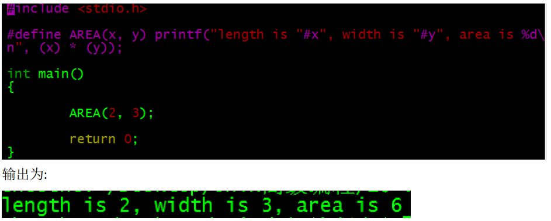
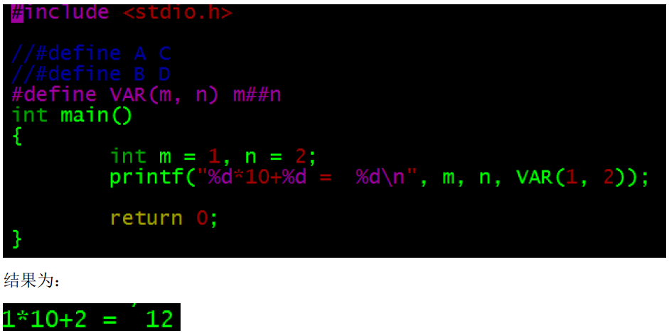

***this directory is just for learning C++ and its related knowledge.*** </br>

***<p align="center"> CONTENT </p>*** </br>


# C基本知识
###  1.  指针   
1.  [指针初级](https://zhuanlan.zhihu.com/p/93449463)   
2.  [指针高级](https://zhuanlan.zhihu.com/p/94518185)   
3.  [void指针](https://www.cnblogs.com/wuyudong/p/c-void-point.html)    
    <span id="jump1">~~jump there~~</span>
4.  [引用和指针](http://irootlee.com/juicer_pointer_reference/)   
5.  常量指针和指针常量

> 常量指针(const int\*): 该指针指向的那个变量是不可被修改的；但它本身的指向可以被修改。  
> 指针常量(int \*const 或者 int const\*): 该指针指向的变量是可以被修改的；但它本身的指向是不能被修改的。  

###   2.  浮点数表示方式   
1.  [float存储方式](http://blog.sina.com.cn/s/blog_973657a00102x2do.html) 
2.  [小数表示](https://blog.csdn.net/github_33873969/article/details/78040129)   

###  [3.  VLA](https://www.cnblogs.com/Suzzz/p/4117431.html)   

###  4.  结构体  
1.  [结构体初始化](https://www.cnblogs.com/clover-toeic/p/3737189.html)   

###  #/##   
1.  #   
    在使用#define 定义宏中，可使用操作符#在字符串中输出实参，如下:
          
2.  ##    
    操作符## 也可以使用在带参数宏中替换部分内容，该操作符将宏中的两部分连接成一个内容， 比如：（咱不知道如何表示字符串，虽然连接起来是字符串，但是 C 语言中，表示字符串是用“”表示的，但是连接后没有双引号）   
        
3.  [#define目前所知最全的](http://c.biancheng.net/view/446.html)     

4.  奇技淫巧  
    1.  [do...while(false)](https://blog.csdn.net/this_capslock/article/details/41843371)   
5.  内建变量  
    1.  [\_\_func\_\_](https://blog.csdn.net/u011308691/article/details/45015613)     
        1.  在结构体的构造函数中，初始化成员列表使用`__func__`是可行的，其效果跟在函数中是用一样，不过将`__func__`标识符作为函数参数的默认值是不允许的：    

        ```
        void func_fail(std::string func_name = __func__) {} //无法通过编译
        ```

            这是因为在参数声明的时候，`__func`还没有被定义.   


# [ C++基础知识](https://www.runoob.com/cplusplus/cpp-tutorial.html)  
+  [參考這個](https://github.com/huihut/interview#-cc)   
+  [protected](https://www.bookstack.cn/read/open-c-book/zh-cha)   

###  1.  python/C++交互(pybind11)待完成    

###  [2.  LeetCode刷题](../LeetcodeLearn)   

###  [3.  C++内存对齐](https://www.cnblogs.com/zhao-zongsheng/p/9099603.html)   
###  [4.  RVO和NRVO](https://www.cnblogs.com/xkfz007/articles/2506022.html)   

###  5.  引用(待规整)   
1.  [指针和引用](#jump1)    
1. [ 弱引用的理解](https://www.cnblogs.com/fengc5/p/5316670.html)    
2. [ 强引用与弱引用的比较](https://blog.csdn.net/Sun960705/article/details/79099533)   
3. [ 左值引用和右值引用](https://www.cnblogs.com/KaiMing-Prince/p/9741393.html)   
```
    int& x = 666;       // Error
    const int& x = 666; // OK
    第一个操作是错误的，它是一个使用int类型的右值来初始化non-const的int&类型的非法操作。第二个操作正确，当然，x是一个常量，你不能改变他。（译者按：注意，常量引用只是规定无法通过该引用改变引用的对象，如果该对象有其他非常量引用或者指针，通过这些改变该对象仍然是合法的）
```
###  6.  [内联函数(不一定非得跟类有关系)](https://www.cnblogs.com/zsq1993/p/5978743.html)    
1.  [内联函数追根究底](https://zhuanlan.zhihu.com/p/50812510)        
###  7.  [使用Valgrind检测C++内存泄露](http://senlinzhan.github.io/page/3/)    
###  8.  [RTTI](https://www.jianshu.com/p/3b4a80adffa7)     
###  9.  智能指针     
1.  [shared_ptr/unique_ptr的deleter初解](https://blog.csdn.net/caroline_wendy/article/details/16938707)       

## 类   
1.  [this指针](https://www.cnblogs.com/Star-Lit/p/8623050.html)    
2.  [重载、覆盖、隐藏](https://www.jianshu.com/p/c5c81ad2e1ce)    
    1.  [重载操作符](https://www.cnblogs.com/ZY-Dream/p/10068993.html)    
3.  [const成员函数](https://blog.csdn.net/u011197534/article/details/78385550)    
4.  [类成员变量初始化顺序](https://blog.csdn.net/shimadear/article/details/82527442)   
5.  [public/private/protected继承](https://www.cnblogs.com/likebeta/archive/2011/10/12/2209044.html)      
###  8. 关键字   
1.  [decltype](https://www.cnblogs.com/QG-whz/p/4952980.html)    
2.  [override](https://blog.csdn.net/jolin678/article/details/63695023)    
3.  constexptr
    1. [理解一]( https://www.cnblogs.com/fushi/p/7792257.html)    
    2. [理解二](https://blog.csdn.net/u012453032/article/details/79485251)    
    3. [理解三](https://www.jianshu.com/p/a809eae05ad8)    
4.  [final关键字](https://blog.csdn.net/u012333003/article/details/28696521)   
5.  [=delete和noncopyble](https://blog.csdn.net/tm8426/article/details/73472496)    
6.  [#if defined](https://blog.csdn.net/wangkeyen/article/details/50971469)   
7.  [\_\_declspec](https://blog.csdn.net/zhaoyin214/article/details/83541613)    
8.  [\_\_attribute\_\_](https://www.jianshu.com/p/e2dfccc32c80)     
9.  [\_\_attribute\_\_(visibility)](https://www.jianshu.com/p/e2dfccc32c80)    
10.  [\_\_builtin\_expect — 分支预测优化](https://www.cnblogs.com/LubinLew/p/GCC-__builtin_expect.html)    
11.  [#pragma once](https://blog.csdn.net/cv_jason/article/details/81842710)    
12.  [=default和=deleted](https://www.ibm.com/developerworks/cn/aix/library/1212_lufang_c11new/index.html)    
13.  [typename](http://feihu.me/blog/2014/the-origin-and-usage-of-typename/)    
14.  [使用using代替typedef]( https://blog.csdn.net/big_yellow_duck/article/details/52224068)   
15.  [mutable](https://blog.csdn.net/aaa123524457/article/details/80967330)    
     1. [另一个mutable](https://liam.page/2017/05/25/the-mutable-keyword-in-Cxx/)    
###  9.  boost
1.  [boost::noncopyable](https://fzheng.me/2016/11/20/cpp_noncopyable_class/)     

###  10.  stl    
1.  [仿函数和适配器](https://blog.csdn.net/coolwriter/article/details/81533226)   
2.  [匿名函数](https://www.cnblogs.com/findumars/p/8062299.html；https://blog.csdn.net/alex1997222/article/details/81154026)   
    1.  [再解](https://www.jianshu.com/p/923d11151027)      
3.  std::function
    1. [理解一](https://www.cnblogs.com/diegodu/p/6180350.html)    
    2. [理解二](https://www.cnblogs.com/ph829/p/5162179.html)    
    3. [std::bind](https://www.jianshu.com/p/621fc81a1dc1)   
    4. [可变模板参数](https://www.cnblogs.com/5iedu/p/7787302.html)   
4.  [std::array初步理解](https://blog.csdn.net/thinkerleo1997/article/details/80415059)       


# C++网络编程    
1. OSI七层模型    
    1.1. [解析一](https://blog.csdn.net/qq\_16093323/article/details/79582554)   
    1.2. [解析二](https://blog.csdn.net/taotongning/article/details/81352985)    
2. [计算机网络编程](https://www.cnblogs.com/5iedu/category/937714.html)     
3. [计算机网络原理](https://www.cnblogs.com/5iedu/category/994985.html)    


#  数据库(待完善)

#  C++多线程\_多进程    
1. [初步了解](https://segmentfault.com/u/zhuyuqing)    
2. [死锁简单理解](https://www.cnblogs.com/eilearn/p/9414962.html)   
3. [临界区](https://www.cnblogs.com/xiaochi/p/8029087.html)    
  1.  临界区的解释   
      临界区是指多使用者可能同时共同操作的那部分代码，比如自加自减操作，多个线程处理时就需要对自加自减进行保护，这段代码就是临界区，我的理解，所谓上锁，是锁的那段代码。   
  2.  互斥锁   
      互斥锁底层的实现其实是基于计算机系统中原子操作（即在同一个时间段内，只有一个CPU能够执行某个操作，如访问某个内存位置）来完成的。不同的CPU架构中，会有不同的指令来完成对应的原子操作。如对于x86而言，有一个xchg指令，它的作用就是将一个CPU寄存器的内容和一个指定位置的物理内存的内容互换。当CPU执行次操作的时候，内存控制器会将该内存位置锁定，其他CPU无法在这个时间段内访问该内存，即使是在这个时候其他CPU发出访问该内存的指令，内存控制器也会先将该访问请求在硬件上缓存到请求队列中，等到前面的xchg指令完成后，再执行该命令。一个简单的例子，比如物理内存为1，则表示该锁锁住，如果为0，则表示该锁处于解锁状态。这时候CPU如果想获取该锁，则先在一个寄存器中填如1，然后将寄存器的值和该内存通过xchg指令互换（原子操作），如果互换完后，寄存器的值为0，则表示CPU获取该锁，并防止其他CPU获取该锁了。如果互换完后，寄存器的值为1，则表示该锁已经被其他CPU获取。   
4.  [各种锁](https://www.dazhuanlan.com/2019/10/11/5d9f5a7b0f5bd/)    
5.  [可重入和不可重入函数](https://murphypei.github.io/blog/2019/07/thread-safe-reentrant-function)   
###  1.  [linux多线程服务端编程](./linux多线程服务端编程.md)   
1.  [伪共享](https://www.cnblogs.com/cyfonly/p/5800758.html)   
2.  [虚假唤醒](https://www.zhihu.com/question/271521213)   

#  Makefile    
0.  两个过程    
    +  CMake包括两个过程：configure和generate。configure的过程就是从输入创建内部表示，generate的过程是生成工程文件过程。    
    +  cmake需要cache文件的原因是每次build的时候，如果有external project，那么无需再次给定环境变量，对于一个项目有多个CMakeLists.txt文件来说比较方便。    
    +  configure的具体过程就是：如果存在CMakeCache.txt则首先读取CMakeCache.txt，否则读取CMakeLists.txt，由cmake的语言解释器解释它，遇到了像include，add_subdirectory命令等，会有command pattern object来执行，并递归解释子目录下的CMakeLists.txt，当所有CMakeLists.txt都解释完后会得到一个CMakeCache.txt文件.     
    +  CMakeCache.txt   
       +  当cmake第一次运行一个空的构建的时候，他就会创建一个CMakeCache.txt文件，文件里面存放了一些可以用来制定工程的设置，比如：变量、选项等
       +  对于同一个变量，如果Cache文件里面有设置，那么CMakeLists文件里就会优先使用Cache文件里面的同名变量。
       +  CMakeLists里面通过设置了一个Cache里面没有的变量，那就将这个变量的值写入到Cache里面
        
          ```
          //变量var的值被设置成1024，如果变量var在Cache中已经存在，该命令不会覆盖cac he里面的值
          SET(var 1024)
          //如果var在Cache中存在，就优先使用Cache里面的值，如果不存在，就将该值写入Cache里面
          SET(var 1024..CACHE..)
          //无论Cache里面是否存在，都始终使用该值
          SET(var..CACHE..FORCE)
          ```

1.  [cmake手册](https://www.cnblogs.com/coderfenghc/tag/cmake/)
  1.  [cmake policy](https://www.cnblogs.com/hustdc/p/6644002.html)   
  2.  [cmake find\_package](https://www.jianshu.com/p/39fc5e548310)   
  3.  [excute_process](https://blog.csdn.net/qq_28584889/article/details/97758450)
  4.  [option()](https://zhjwpku.com/2019/11/15/cmake-basic-commands-intro.html)
  5.  [cmake_dependent_option](http://www.up4dev.com/2019/12/12/cmake_dependent_option/)
  6.  [cmake  function() macro()](https://elloop.github.io/tools/2016-04-11/learning-cmake-3-function-macro)
2.  cmake实践这本书   
3.  [cmake下载路径](https://cmake.org/files)  
4.  cmake 构建选项
    1.  -C(没查出来什么意思)
    2.  -G
        通过 CMake 生成特定 IDE 的项目配置文件。这个操作依赖 IDE，即无法在一个没安装 Xcode 的 macOS 上通过 CMake 生成对应的工程文件。
        +  -GXcode 生成 Xcode 工程文件
        +  -GVisual Studio 15 2017 生成 Visual Studio 2017 工程文件
        +  -G"UnixMakefiles", 指定构建系统，当前只想创建Linux/Unix系统标准Makefile。所以指定为Unix Makefile.
    3.  CMAKE_BUILD_TYPE
        指定构建模式，比如 Debug 还是 Release，默认值 Debug
    4.  -H -B
        -H 用来指定一个源码目录，指定的目录必须含有一个 CMakeLists.txt 文件，-B 用来指定 CMake 生成的中间文件的存放目录。
        -H..\cocos2d-x -Bmsvc_build 指定要构建工程的工程路径是上一级目录的 cocos2d-x 子目录，指定 CMake 生成的文件存放在 msvc_build 目录。
    5.  --build   
        执行构建过程，同时指定曾使用 CMake 命令生成的构建文件所在目录。   
        cmake --build ./msvc_build 在执行这个构建过程时，CMake 会自动选择对应的构建工具。    
    6.  -D    
        -D后面不能有空格，例如：cmake -DCMAKE_BUILD_TYPE:STRING=Debug     
    7.  -U    
        此选项和-D功能相反，从Cache文件中删除变量，支持使用*和？通配符    
    8.  打印运行的每一行CMake
        +  命令行选项中：--trace，将打印运行的每一行CMake，例如windows下执行: cmake –trace ..
        +  命令：--trace-source="filename"就会打印出有关filename的执行
5.  cmake命令  
    1.  设置编译参数    
        +  add_definitions（-DENABLED），当在CMake里面添加该定义的时候，如果代码里面定义了#ifdef ENABLED #endif相关的片段，此时代码里面这一块代码就会生效   
        +  add_definitions( “-Wall -ansi –pedantic –g”)：该命令现已经被取代，使用： add_compile_definitions(WITH_OPENCV2)    
    2.  [add_custom_command()/add_custom_target()](https://zhuanlan.zhihu.com/p/95771200)
    3.  source_group命令    
        使用该命令可以将文件在VS中进行分组显示；source_group("Header Files" FILES {HEADER_FILES})；以上命令是将变量HEADER_FILES里面的文件，在VS显示的时候都显示在“Header Files”选项下面    
    4.  [add_subdirectory](https://zhuanlan.zhihu.com/p/85980099)   
    5.  [add_test](https://www.thinbug.com/q/36304289)  
        +  enable_testing(): 启用CMake项目的测试功能，只能在顶层CMakeLists.txt中使用。开启后能够使用add_test()命令    
        +  add_test(testname executable arg1 …)：使用CTest运行测试，executable可以是测试程序、脚本等，接下来给代码添加测试
    6.  [aux_source_directory](https://elloop.github.io/tools/2016-04-10/learning-cmake-2-commands)
    7.  build_command(查不到)   
    8.  configure_file(查不到)    
    9.  option    
        [理解](https://www.cnblogs.com/rickyk/p/3872568.html)   
    10. set   
        [理解](https://www.cnblogs.com/narjaja/p/8351500.html)    
6.  变量    
    1.  CMAKE_INSTALL_MESSAGE(查不到)   
    2.  CMAKE_CXX_STANDARD    
        C++11标准   
___待总结___

#  Shell  
1.  [shell中的符号](https://www.jb51.net/article/120595.htm)   
2.  [批量修改文本的内容](https://blog.csdn.net/qq_21101587/article/details/81203767)


#  设计模式    
1.  [设计模式](https://www.cnblogs.com/5iedu/category/825371.html)    
2.  [另一个版本的设计模式](https://www.cnblogs.com/WindSun/p/10223126.html)   


#  异常   
1.  [noexcept](https://www.cnblogs.com/sword03/p/10020344.html)    


#  预处理、编译、汇编、链接    
###  1.  [内存映射]   
1.  [理解一](https://www.bookstack.cn/read/think-os-zh/ch3.md)   
2.  [理解二](https://blog.csdn.net/williamgavin/article/details/83240402)    
###  2.  [C语言编程透视](https://www.bookstack.cn/read/open-c-book/zh-chapters-02-chapter2.markdown#toc\_27212\_14734\_2)
###  3.  [预处理](./程序怎么运行的/README.md)    
###  4.  [ELF文件格式](https://luomuxiaoxiao.com/?p=139)   
###  5.  [ELF格式解析](https://paper.seebug.org/papers/Archive/refs/elf/Understanding_ELF.pdf)    
###  6.  [可重定位文件](http://liujunming.top/2016/07/19/%E8%AE%A1%E7%AE%97%E6%9C%BA%E7%B3%BB%E7%BB%9F%E4%B8%AD%E7%9A%84%E9%93%BE%E6%8E%A5%EF%BC%88%E4%B8%80%EF%BC%89/)   
###  7.  [fPIC](https://www.cnblogs.com/cswuyg/p/3830703.html)    
###  8.  [通过GDB调试理解GOT/PLT](http://rickgray.me/2015/08/07/use-gdb-to-study-got-and-plt/)    
###  9.  [某些section的作用](https://www.cnblogs.com/arnoldlu/p/7136701.html)  
###  10.   [动态库](./Linux下的动态连接库及其实现机制修订版.rtf)    
###  11.  动态链接   
1.  [理解一](https://www.jianshu.com/p/5deed1bf82b4)   
2.  [理解二](https://github.com/tinyclub/open-c-book/blob/master/zh/chapters/02-chapter4.markdown)     
###  12.  [C++编译器优化](https://www.agner.org/optimize/#manuals)   


#  gdb    
###  1.  [一个程序的整体流程](https://www.nosuchfield.com/2018/11/23/Program-compilation-linking-loading-and-running/)   
###  2.  [gdb调试基础](https://wiki.ubuntu.org.cn/%E7%94%A8GDB%E8%B0%83%E8%AF%95%E7%A8%8B%E5%BA%8F)   
###  3.  [100个gdb技巧](https://www.kancloud.cn/itfanr/i-100-gdb-tips/81888)   
###  4.  [gprof](https://www.cnblogs.com/feisky/archive/2010/03/09/1681997.html)   
###  5.  [打印函数栈](https://ivanzz1001.github.io/records/post/cplusplus/2018/11/08/cpluscplus-gdbusage_part4)


#  汇编   
###  1.  [两种汇编格式](https://www.ibm.com/developerworks/cn/linux/l-assembly/index.html)   
###  2.  [rsp和rbp](https://zhuanlan.zhihu.com/p/27339191)   
###  3.  [寄存器](https://www.jianshu.com/p/57128e477efb)   
###  4.  [寻址方式](https://www.hadoop1024.com/2018/12/16/assembly-language-chapter03/)   


#  优化
###  1.  [simd](https://zhuanlan.zhihu.com/p/55327037)   
###  2.  [open mp](https://blog.csdn.net/ArrowYL/article/details/81094837)  
1.  [open mp英文版](https://bisqwit.iki.fi/story/howto/openmp/)   
2.  [openmp博客版本](http://www.uml.org.cn/c%2B%2B/201810291.asp) 


#  C++11
###  1.  [深入理解C++11](./深入理解C++11/README.md)            
###  2.  [Effective Modern C++(部分翻译)](https://github.com/kelthuzadx/EffectiveModernCppChinese)     
###　3.  [另一个完整版本的Effective Modern C++的翻译](https://blog.csdn.net/zhangyifei216/article/details/72868345)    
###  4.  [Effective Modern C++(英文书)](./)


#  泛型编程和元编程
###  1.  C++ Templates: The Complete Guide (2nd Edition)   
###  2.  C++ Template Metaprogramming: Concepts, Tools, and Techniques from Boost and Beyond    
###  3.  C++ Concurrency in Action: Practical Multithreading   

#  内核      
###  1.  [CPU解释](https://www.cnblogs.com/kimsimple/p/7787018.html)      
###  2.  [CPU执行指令](https://www.cnblogs.com/dream-to-pku/p/11601264.html)   
###  3.  [操作系统的重点](https://www.ahaknow.com/pkucs-operating-system-overview/#jin_cheng_xian_cheng_mo_xing)  
###  4.  [PCB的解释](https://zhuanlan.zhihu.com/p/32341542)  

#  cuda编程
+  [cuda C++ best practices guide](https://s0docs0nvidia0com.icopy.site/cuda/cuda-c-best-practices-guide/index.html#what-is-this-document)   
+  [threadIdx/blockIdx/blockDim/gridDim](https://www.cnblogs.com/rainbow70626/p/6498738.html)    
