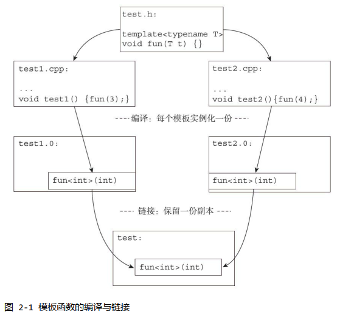
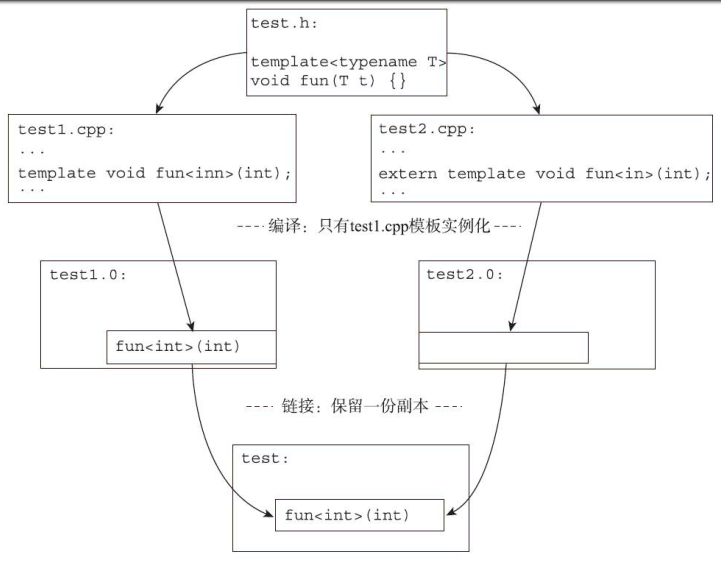

___深入理解C++11___

### C++引入新的关键字   
1.  [alignas]
2.  [alignof]
3.  [decltype]
4.  [auto重新定义]
5.  [static_assert]
6.  [using重新定义]
7.  [noexcept]
8.  [export]
9.  [nullptr]
10.  [constexpt]
11.  [thread_local]

###

1. \_Pragma操作符   
    在c/c++标准中，`#pragma`是一条预处理指令。简单的说，`#pragma`是用来想编译器传达语言标准以外的信息。例如：
    ```
    #pragma once
    ```
    那么该指令会指示编译器(如果编译器支持)，该头文件应该只被编译一次。这与使用如下代码定义头文件的效果是一样的：
    ```
    #ifndef THIS_HEADER
    #define THIS_HEADER

    #endif
    ```
    在C++11中，标准定义了与预处理指令`#pragma`功能相同的操作符`_Pragma`。格式如下：
    ```
    _Pragma(字符串字面量)
    ```
    其使用方法跟`sizeof`等操作符一样，将字符串字面量作为参数写在括号中即可。那么要达到与上例`#pragma`类似的效果，如下：
    ```
    _Pragma("once");
    ```
    相比预处理指令`#pragma`，由于`_Pragma`是一个操作符，因此可以用在宏中：
    ```
    #define CONCAT(x) PRAGMA(concat on#x)
    #define PRAGMA(x) _Pragma(#x)
    CONCAT(..\concat.dir)
    ```
    这里`CONCAT(..\concat.dir)最终会产生_Pragma(concat on "..\concat.dir")`，而`#pragma`则不能在宏中展开，灵活性没有`_Pragma`强。     

2.  变长参数的宏定义以及\_\_VA_ARGS\_\_     
    在c99标准中，程序员可以使用变长参数的宏定义。变长参数的宏定义是指在宏定义中参数列表的最后一个参数为省略号，而预定义宏`__VA_ARGS__`则可以在宏定义的实现部分替换掉省略号所代表的字符串。    
3.  宽窄字符串的连接      
    在之前的C++标准中，将窄字符串(char)转换成宽字符串(wchar_t)是未定义的行为。而在C++11标准中，在将窄字符串和宽字符串进行连接时，支持C++11标准的编译器会将窄字符串转换为款字符串，然后再域宽字符串连接。    
4.  long long整型   
    long long类型进入了C99标准， 后面也进入了C++11标准。有两种long long: long long 和 unsigned long long，在C++11中，标准要求long long整型可以在不同平台上有不同的长度，但至少也有64位。在写常数字面量时，可以是用LL后缀、ll后缀；或者使用ULL、ull、Ull、uLL表示一个unsigned long long类型的字面量。   
    与long long等价的类型：long long、signed long long、long long int、signed long long int; unsigned long long等价的 unsigned long long int。    
    同其他整型一样，要了解平台上long long 大小的方法就是查看<climits> 或者<limits.h>，与long long相关的有三个：LLONG_MIN、LLONG_MAX、ULLONG_MIN，分别代表 最大值，最小值，最大unsigned long long值。        
5.  C++11一共定义了5中标准的有符号整型：signed char、short int、int、long int、 long long int。   
    C++规定，扩展的整型必须与标准类型一样，有符号和无符号类型占用同样大小的内存空间。    
    隐式转换规则：    
    1.  长度相同的情况下，标准整型的等级高于扩展类型，比如long long int和_int64如果都是64位长度，则long long int类型的等级高。      
    2.  长度越大的整型等级越高，比如long long int等级高于int.   
    3.  相同大小的有符号和无符号类型等级相同，比如int, unsigned int等级相同。   
    4.  在进行隐式整型转换的时候，一般都是按照低等级整型转换为高等级整型，有符号转换为无符号。    
6.  宏\_\_cplusplus   
   ```
   #ifdef __cplusplus
   extern "C" {
   #endif

   #ifdef __cplusplus
   }
   #endif
   ```
    这种类型的头文件可以被#include到C文件进行编译，也可以被#include到C++文件中进行编译。由于extern "C"可以抑制C++对函数名、变量名等符号进行重整，因此编译出的C目标文件和C++目标文件中的变量、函数名称等符号都是相同的，链接器可以可靠地对两种类型的目标文件进行连接。    
    程序员可能认为`__cpluscplus`这个宏只有被定义了和未定义两种状态。事实上并非如此`__cplusplus`这个宏通常被定义为一个整型值。而且随着标准变化，`__cplusplus`宏一般会是一个比以往标准更大的值。在C++03它的值为199711L, 在C++11标准中，它的值为201103L。这点变化可以为代码所用，比如程序员想要确定代码是是用C++11编译器进行编译时：
    ```
    #if __cplusplus < 201103L
    #error "should use C++11 implementation"
    #endif
    ```
    这里是用预处理指令，使得不支持C++11的立即终止。    
7.  静态断言    
    1.  运行时与预处理时    
        在C++中，标准在<cassert>或者<assert.h>头文件定义了assert宏，用于在__运行时__进行断言：    
        在C++中，程序员也可以定义宏NDEBUG来禁用assert宏。这对于发布程序来说是必要的，因为用户对程序退出是敏感的。assert宏在<cassert>中的实现方式类似于下面：   
        ```
        #ifdef NDEBUG
        #define assert(expr) (static_cast<void>(0)
        #else
        ...
        #endif
        ```
        一旦定义了NDEBUG宏，assert宏将被展开为一条无意义的C语句（通常会被编译器优化掉）    
        \#if 和 #error通常也可以在预处理阶段进行断言。    
    2.  静态断言与static_assert     
        相交于上面两个运行的阶段来说，有时候我们希望在编译时能够做断言：    
        ```
        #include <casert>
        #include <cstring>

        using namespace std;

        template<typename T, typename U>
        int bit_copy(T& a, U& b) {
          assert(sizeof(b) == sizeof(a));
          memcpy(&a, &b, sizeof(b));
        }

        int main()
        {
          a = 0x2468;
          double b;
          bit_copy(a, b);
        }
        ```
        上面，如果bit_copy不被调用，我们将无法触发断言，实际上，正确产生断言的时机应该在模板 实例化上，即编译期间。   
        实现编译期间断言的方法：
        1.  Boost内置的BOUST_STATIC_ASSERT断言机制(利用sizeof)。    
        2.  利用除“0”导致编译器报错这个特性来实现静态断言。       
        ```
        #define assert_static(e)          \
        do {                              \
          enum{assert_static_ = 1 / (e)}  \
        } while(false)
        ```
        真正起作用的是`1/(e)`这个表达式，主要信息是除0错误，BOOST_STATIC_ASSERT主要信息是sizeof错误。这两种方式缺陷很明显：诊断信息不够充分。    
        在C++11中，引入assert_static解决这个问题，它接受两个参数，一个是断言表达式，这个表达式通常需要返回bool，一个则是警告信息，通常是字符串：    
        ```
        static_assert(sizeof(a) == sizeof(b), "the parameter of bit_copy must have same width");
        ```
        反过来说，static_assert断言表达式必须是在编译期间就可以计算的表达式，即必须是常量表达式，如果是用了变量，则会导致错误。    
8.  noexcept修饰符与noexcept操作符    
    noexcept表示其修饰的函数不会抛出异常，编译器可以选择直接调用std::terminate()函数来终止程序的运行，这比基于异常机智的throw()在效率上会高一些，这是因为异常机智会带来一些额外的开销，比如函数跑出异常会导致函数栈被一次的展开，并依帧调用在本帧中以构造的自动变量的析构函数等。    
    从语法上讲，有两种是用形式：    
    1.  在函数声明后面加上noexcept关键字：    
        ```
        void excpt_func() noexcept;
        ```
    2.  可以接受一个常量表达式作为参数：    
        ```
        void excpt_func() noexcept(常量表达式);
        ```
    常量表达式的结果会被转换成一个bool类型的值，该值为true，表示函数不会抛出异常，反之则有可能跑出异常。通常情况下，C++11是用noexcept可以有效的阻止异常的传播与扩散。   
    ```
    template <typename T>
    void func noexcept(noexcept(T())) {}
    ```
    这里的fun是否是一个noexcept函数，将有T()表达式是否会跑出异常所决定，这里的第二个noexcept是一个noexcept操作符。当其参数是一个有可能跑出异常的表达式的时候，其返回false，否则返回true。这样以来，我们就可以根据条件实现noexcept修饰的版本或无noexcept修饰的版本。
    但要注意，noexcept修饰的函数通过std::terminate的调用来结束程序的执行会带来很多问题，比如无法保证对象的析构函数的正常是用，无法保证栈的自动释放等等。但有的时候暴力终止程序是很有效的方法。    
    C++98中存在这是用throw()来声明不抛出异常的函数。    
    ```
    template <typename T>
    static constexpr T min() throw() { return T(); }
    ```

    当然，noexcept更大的作用是保证应用程序的安全。比如一个类析构函数不应该抛出异常，那么对于常常被析构函数调用的delete函数来说，C++11默认讲delete函数设置为noexcept。这样可以提高应用程序的安全性。    

    ```
    void operator delete(void*) noexcept;
    void operator delete[](void*) noexcept;
    ```
    出于同样的安全考虑，C++11标准中让类的析构函数默认也是noexcept(true)的。   
9.  快速初始化成员变量      
    在C++98中，支持了在类声明中是用等号加初始值的方式来初始化类中静态成员变量。这种声明方式我们称之为就地声明。不过C++98对类中的就地声明要求非常高。如果静态成员变量不满足常量性，则不可以就地声明，就而且即使常量的静态成员也只能是整型或者枚举类型才能就地初始化，而非静态成员变量的初始化则必须在构造函数中执行。      
    在C++11中，标准允许非静态成员变量的初始化有多重方式，除了初始化列表意外，在C++11中，标准还允许是用等号，或者花括号进行__就地__的非静态成员标量初始化。    
    对于非静态成员进行就地初始化，()和{}并非等价的：    
    ```
    struct C {
      C(int i) : c(i) {}
      int c;
    };

    struct init {
      int a = 1;
      string b("hello"); //无法通过编译
      C c(1); // 无法通过编译
    }
    ```
    C++11标准保留了就地初始化和初始化列表两种方式，两种并不冲突，当你是用两种方式都对某一非静态变量初始化的时候，初始化列表总是“后作用于”非静态成员，也就是说，初始化列表的效果总是优先于就地初始化的。    
    对于非常量的静态成员变量，C++和C++98都需要在头文件以外去定义它，这回保证编译时，类惊天成员的定义最后值存在于一个目标文件中。      
10.  非静态成员的sizeof    
     在C++98中，对非静态成员变量是用sizeof是通不过编译的。   
     ```
     #include <iostream>
     using namespace std;

     struct People {
     public:
       int hand;
       static People* all;
     };

     int main()
     {
       People p;
       cout << sizeof(p.hand) << endl; //C++98通过、C++11通过
       cout << sizeof(People::all) << endl;// C++98通过，C++11通过
       cout << sizeof(People::hand) << endl;//C++98错误，C++11通过
     }
     ```
     在C++11中，对非静态成员变量是用sizeof是合法的，在C++98中，只有静态成员，或者对象的实例才能对其成员进行sizeof操作。在C++98编译器里，在没有定义类实例的时候，要获取类成员大小我们通常是用：      
     ```
     sizeof(((People*)0)->hand);
     ```
     这里我们强制转换0 为一个People类的指针，在C++11中，我们无需是用这样的技巧。    
11.  扩展的friend语法      
     friend ___关键字___。友元无视类中成员的属性，无论是不是private，友元类或者友元函数都可以访问，这破坏了封装性。
     ```
     class Poly;
     typedef Poly P;

     class Lilei {
       friend class Poly;//C++98通过， C++11通过
     };

     class Jim {
       friend Poly; //C++98失败，C++11通过
     };

     class HanMeiMei {
       friend P; //C++98失败，C++11通过
     };
     ```
     在上面代码中可以看出，C++11中，声明一个类为另一个类的友元，不在需要是用class关键字。甚至是用别名也可以。这个小改进，使得程序员可以为类模板声明友元了。在C++98是无法做到的。   
     ```
     class P;
     template<typename T>
     class People {
       friend T;
     };
     People<P> PP; //类型P在这里是People类型的友元
     People<int> Pi; //对于int类型模板参数，友元声明被忽略
     ```
     从上面可以看到，在是用内置类型int作为模板参数的时候，People<int>会被实例化为一个普通的没有友元定义的类型。这样以来，我们就可以在模板实例化时才确定一个模板类是否有友元，以及谁是这个模板类的友元。      
12.  final/override控制     
     final关键字的作用是使派生类不可覆盖(重写)它所修饰的虚函数。      
     ```
     struct Object {
      virtual void fun() = 0;
     };

     struct Base: public Object {
      void fun() final(); //声明为final
     };

     struct Derived: public Base {
      void fun(); //无法通过编译
     };
     ```
     派生于Base的Derived类对借口fun的重载会导致编译时错误。但是从接口派生的角度而言，final可以在派生过程中任意的阻止一个接口的可重载性。在C++中重载还有一个特点，就是对于积累声明为virtual的函数，之后的重载版本都不需要再声明该重载函数为virtual。即使再派生类中声明了virtual，该关键字也是编译器可以忽略的。    
     在C++11中为了帮助程序员写继承结构复杂的类型，引入了虚函数描述符override，如果派生类在虚函数声明时是用了override描述符，那么该函数必须重载其积累中的同名函数，否则代码将无法通过编译。    
     ```
     struct Base {
      virtual void turing() = 0;
      virtual void dijkstra() = 0;
      virtual void vneumann(int g) = 0;
      virtual void dknuth() const;
      void print();
     };

     struct DerivedMid: public Base {
      void vneumann(double g);
     };

     struct DerivedTop: public DerivedMid {
      void turing() override;
      void dikjstra() override; //无法通过编译，拼写错误，并非重载
      void vneumann(double g) override; //无法通过编译，参数不一致，并非重载
      void dknuth() override; //无法通过编译，常量性不一致，并非重载
      void print() override; //无法通过变异，非虚函数重载
     }
     ```
     如果没有`override`修饰符，DerivedTop的作者可能在编译后都没有意识到自己犯了这么多错误。因为编译器对以上的错误不会有任何警示。这里`override`修饰符可以保证编译器辅助地做一些检查。    
     此外，在C++中，如果一个派生类的编写者自认为新写了一个接口，而实际上却冲在了一个底层的接口，出现这种情况编译器是爱莫能助的。    
13.  C++98标准不支持函数模版的默认模板参数。不过在C++11中，这一限制已经被解除了。    
    ```
    void def_param(int m = 3) {} //c++98编译通过，c++11编译通过
    template <typename T = int>
    class DefClass {}; //c++98编译通过，c++11编译通过

    template <typename T = int>
    void DefTemParam() {} //c++98编译失败，c++11编译通过
    ```
    与类模板有些不同的是，在为多个默认模板参数声明指定默认值的时候，程序员必须遵照“从右至左”的规定，而这个条件对函数模板来说并不一定是必须的。    
    ```
    template <typename T1, T2 = int>
    class DefClass1;

    template <typename T1 = int, typename T2>
    class DefClass2; //无法通过编译

    template<typename T, int i = 0>
    class DefClass3;

    template<int i = 0, typename T>
    class DefClass4; //无法通过编译

    template<typename T1 = int, typename T2>
    void DefFunc1(T1 a, T2 b);

    template <int i = 0, typename T>
    DefFunc2(T2);
    ```
    从上面的代码可以看到，默认模板参数的位置则比较随意。模板函数的默认形参不是模板参数推导的依据，函数模板参数的选择，总是由函数的实参推导而来。      
14.  外部模板   
     外部模板是C++11的一个关于模板性能上的改进。    
     我们在a.c定义一个变量int 9; 而在另一个文件b.c想要是用它，这时候我们可以在b.c中使用`extern int i;`这样的好处是，分别编译两个文件，其生成的a.o和b.o只有i这个符号的一份定义。如果b.c中我们不将i声明为extern的话，那么a.o和b.o会存在两个i的定义。    
     对于函数模板来说，我们会遇到一模一样的问题，这样的困境是由于模板的实例化带来的。    
     ```
     //比如我们在test.c的文件中声明了如下模板函数
     template <typename T>
     void fun(T) {}
     //在第一个test1.cpp文件中，我们定义如下：
     #include "test.h"
     void test1() { func(3); }
     //而在另一个test2.cpp文件中，我们定义如下代码：
     #include "test.h"
     void test2() { fun(4); }
     ```
     由于两个源代码是用的木板函数的参数类型一致，所以在编译test1.cpp的时候，编译器实例化出了函数`fun<int>(int)`，而当编译test2.cpp的时候，编译器又一次实例化出了函数`fun<int>(int)`。那么在test1.o和test2.o目标文件中，会有两份一模一样的函数`fun<int>(int)`代码。   
     链接器通过一些编译器辅助的手段将重复的木板函数代码`fun<int>(int)`删除掉，只保留了单个副本。如下图：    
     
     不过读者注意到了，对于源代码中的每一处模板实例化，编译器都需要做实例化工作，而在链接时，链接器还需要移除重复的实例化代码。解决这个问题的方法基本跟变量共享的思路时一样的，就是是用__外部的__模板。      
     外部模板的是用实际上依赖与C++98中一个已有的特性，即_显式实例化_：   
     ```
     template<typename T>
     void fun(T) {}

     //我们只需要声明：
     template void fun<int> (int);
     ````
     这就可以使编译器在本编译单元中实例化出一个fun<int>(int)版本的函数（这种做法也被称为强制实例化）。而在C++11标准中，又加入了__外部模板__的声明：      
     ```
     extern template void fun<int>(int);
     ```
     这样的语法完成一个外部模板的声明。   
     ```
     // 在test1.cpp做显示实例化
     #include "test.h"
     
     template void fun<int>(int); //显示地实例化

     void test1() { fun(3); }

     //在test2.cpp中做外部模板声明
     #include "test.h"
     extern template void fun<int>(int); //外部模板声明
     void test1() { fun(3); }
     ```
     这样以来，在test2.o中不会再生成fun<int>(int)的示例代码，如下：      
     

