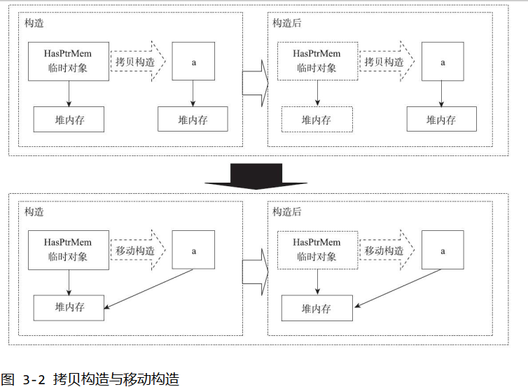

1.  继承构造函数    
    以前我们这样使用：    
    ```
    struct A {
      A(int i) {}
      A(double d, int i) {}

      A(float f, int i, const char* c) {}
    };

    struct B: public A{
      B(int i) : A(i) {}
      B(double d, int i): A(d, i) {}
      B(float f, int i, const char* c): A(f, i, c) {}

      virtual void extra_inter_face();
    }
    ```
    以前我们的继承初始化要这么写，虽然B只添加了一个接口。在以前的C++中要在构造B的时候想要拥有A这样多的构造方法的话，就必须“透传”各个接口。事实上C++11已经有了一个好用的规则，就是如果派生类要是用积累的成员函数的话，可以通过`using`来完成：     
    ```
    #include <iostream>

    using namespace std;

    struct Base {
      void f(double i){
        cout << "Base" << i << endl;
      }
    };

    struct Derived: Base {
      using Base::f;

      void f(int i) {
        cout << "Derived: " << i << endl;
      }
    };

    int mian()
    {
      Base b;
      b.f(4.5); //Base:4.5
      Derived d;
      d.f(4.5); //Base: 4.5
    }
    ```
    上面的代码中，如果没有`using Base::f`，事实上我们隐藏了`Base::f(double)`，但是现在使用了这个`using`，在Derived里面，就有了两个f函数(相当于重载)。这样的思想也扩展到了构造函数中，子类可以通过是用`using`声明来继承基类的构造函数：     
    ```
      struct A {
      A(int i) {}
      A(double d, int i) {}

      A(float f, int i, const char* c) {}
    };

    struct B: public A{
      using A::A; //继承构造函数

      virtual void extra_inter_face();
    }
    ```
    这里我们就可以通过`using A::A`的声明，把基类中的构造函数_悉数_集成到派生类B中。这样上面的”透传“构造函数就不在需要了。而且更为精巧的是，C++11标准继承构造函数被设计为跟派生类中的各个类默认函数(默认构造、析构、拷贝构造)一样，是隐式声明的。这意味着如果一个继承构造函数不被相关代码，编译器不会为其产生真正的函数代码。      
    不过继承构造函数只会初始化基类的成员变量，对于派生类中的成员变量则无能为力，不过我们可以是用类成员的初始化表达式，为派生类成员变量设定一个默认值还是没有问题的：    
    ```
    struct A {
      A(int i) {}
      A(double d, int i) {}

      A(float f, int i, const char* c) {}
    };

    struct B: public A{
      using A::A; //继承构造函数

      int d{0};
    }

    int main()
    {
      B b(356); // b.d被初始化为0
    }
    ```
    有的时候，基类构造函数的参数会有默认值。对于继承构造函数来将，参数的默认值是不会被继承的。事实上， 默认值会导致基类产生多个构造函数的版本， 这些函数版本都会被派生类继承：     
    ```
    struct A {
      A (int a = 3, double = 2.4) {}
    };

    struct B : A {
      using A::A;
    };
    ```
    基类的构造函数`A(int a = 3, double = 2.4)`有一个接受两个参数的构造函数，且两个参数俊有默认值，那么A到底可能有多少个可能的构造函数的版本呢？    
    事实上，B可能从A中继承来的候选继承构造函数有如下一些：    
    +  A(int = 3, double = 2.4) //这是使用两个参数的情况
    +  A(int = 3) //这是减掉一个参数的情况
    +  A(const A&) //这是默认的复制构造函数
    +  A() //这是不适用参数的情况    
    相应地，B中构造函数将会包括以下一些：   
    +  B(int, double) //这是继承构造函数
    +  B(int) //这是减少掉一个参数的继承构造函数
    +  B(const B&) //这是复制构造函数，这不是继承来的
    +  B() //这是不包含参数的默认构造函数
    可以看到，参数默认值会导致多个构造函数版本产生，因此程序员在是用有参数默认值的构造函数的基类的时候，__必须小心__。    
    有的时候，我们会遇到继承构造函数”冲突“的情况，这通常繁盛在派生类有多个基类的时候。多个基类中的部分构造函数可能导致派生类中的继承构造函数的函数名、参数都相同。那么继承类中的冲突的继承构造函数将会导致不合法的派生类代码：    
    ```
    struct A {
      A(int) {};
    };
    struct B {
      B(int) {};
    };

    struct C: A, B {
      using A::A;
      using B::B;
    };
    ```
    A和B的构造函数会导致C中重复定义相同类型的继承构造函数。可以通过显示定义继承类的冲突的构造函数，阻止隐式生成相应的继承构造函数来解决冲突：      
    ```
    struct C: A, B {
      using A::A;
      using B::B;

      C(int) {}
    };
    ```
    另外，如果基类的构造函数被声明为私有成员函数，或者派生类是从基类中___虚继承___的，那么就不能在派生类中声明继承构造函数。此外，如果一旦使用类继承构造函数，编译器就不会再为派生类生成默认构造函数了。如以下，变量b的定义应该是不能够通过编译的：      
    ```
    struct A {
      A(int) {}
    };

    struct B: A {
      using A::A;
    };

    B b; //B没有默认构造函数
    ```
2.  委派构造函数    
    委派构造函数也是C++11中对C++的构造函数的一项改进，其目的是为了减少程序员写构造函数的时间。    
    ```
    class Info {
    public:
      Info(): type(1), name('a') {
        init_rest();
      }

      Info(int i): type(i), name('a') {
        init_rest();
      }
      Info(char e): type(1), name(e) {
        init_rest();
      }

    private:
      void init_rest();

      int type;
      char name;
    };
    ```
    上面代码，可以看到，除了初始化列表有所不同，其他部分3个构造函数基本上是相似的，因此其代码有很多重复，改进：    
    ```
    class Info {
    public:
      Info() {
        init_rest();
      }

      Info(int i): type(i) {
        init_rest();
      }
      Info(char e): name(e) {
        init_rest();
      }

    private:
      void init_rest();

      int type{1};
      char name{'a'};
    };
    ```
    这样虽然简单了不少，但在现实变成中，构造函数中的代码会更长，比如可能还需要调用一些基类的构造函数，那么能不能在一些构造函数中，连`init_rest`都不用调用呢？     
    这是可以的。但是前提是我们能够将一个构造函数设定为”基准版本“，比如本例的`Info`版本的构造函数，而其他构造函数可以通过委派”基准版本“来进行初始化：      
    ```
    Info() { init_rest(); }
    Info(int i) {
      this->Info(); 
      type = i;
    }
    Info (char e) {
      this->Info();
      name = e;
    }
    ```
    这里我们通过this指针调用基准版本的构造函数，不过可惜的时，一般的编译器都会阻止`this->Info()`的编译。原则上，编译器不允许在构造函数中调用构造函数，即使参数看起来不相同。      
    ```
    Info() { init_rest(); }
    Info(int i) {
      new(this)->Info(); 
      type = i;
    }
    Info (char e) {
      new(this)->Info();
      name = e;
    }
    ```
    这里我们是用了placement new来强制在本对象地址（this指针所指地址）上调用类的构造函数。这样我们就可以绕过编译器的检查，从而在2个构造函数中调用我们的”基准版本“。这种方法看起来不错，却是在已经初始化一部分的对象上再次调用构造函数。因此这个方法虽然能够有效，却是一个危险的做法。    
    在C++11中，我们可以是用委派构造函数来达到期望的效果，C++11中委派构造函数是在构造函数的初始化列表位置进行构造的、委派的：      
    ```
    class Info {
    public:

      Info() { init_rest(); }
      Info(int i): Info() {
        type = i;
      }
      Info (char e): Info() {
        name = e;
      }

    private:
      void init_rest();

      int type{1};
      char name{'a'};
    };
    ```
    我们在初始化列表的位置，调用了”基准版本”的构造函数Info()。这里我们为了区分被调用者和调用者, 称在初始化列表中调用“基准版本”的构造函数为委派构造函数。而被调用的“基准版本”则为目标构造函数。在C++11，所谓委派构造，就是指委派函数将构造的任务委派给了目标构造函数来完成这一类的构造的方式。      
    委派构造函数只能在函数体内为成员变量赋初值，这是由于委派构造函数不能有初始化列表造成的。在C++中，构造函数不能同时”委派“和是用初始化列表，所以如果委派构造函数要给变量赋值只能放在函数体中。这样的话，上面的代码就不那么令人满意了，因为初始化列表的初始化方式总是先于构造函数完成的（实际上在编译完成时就已经决定了）。不过我们可以稍微改造一下目标函数，使得委派构造函数依然可以在初始化列表中初始化所有成员：      
    ```
    class Info {
    public:

      Info(): Info(1, 'a') {}
      Info(int i): Info(i, 'a') {}
      Info (char e): Info(1, e) {}

    private:
      Info(int i, char e): type(i), name(e) { //其他初始化 }

      int type{};
      char name{};
    };
    ```
    在构造函数比较多的时候，我们可能拥有不止一个委派构造函数，而一些目标构造函数很可能也是委派构造函数，这样以来，在委派构造函数中就会形成链状委派构造关系：      
    ```
    class Info {
    public:

      Info(): Info(1) {} //委派构造函数
      Info(int i): Info(i, 'a') {} //既是目标构造函数，也是委派构造函数
      Info (char e): Info(1, e) {}

    private:
      Info(int i, char e): type(i), name(e) { //其他初始化 } //目标构造函数

      int type{};
      char name{};
    };
    ```
    这样写是可以的，但是要注意别形成___环___。    
    委派构造的一个实用的应用就是是用构造模板寒素产生目标构造函数：      
    ```
    #include <list>
    #include <vector>
    #include <deque>

    class TDConstructed {
      template<typename T>
      TDConstructed(T first, T last): l(first, last) {}
      list<int> l;

    public:
      TDConstructed(vector<short> &v): TDConstructed(v.begin(), v.end()) {}
      TDConstructed(deque<int> &d): TDConstructed(d.begin(), d.end()) {}
    }
    ```
    T会被分别推导为`vector<short>::iterator`和`deque<int>::iterator`两种类型。      
    此外，在异常处理方面，如果在委派构造函数中是用try的话，那么目标构造函数中产生的异常，都可以在委派构造函数中被捕获到：      
    ```
    #include <iostream>

    class DCExcept {
    public:
      DCExcept(double d) {
        try: DCExcept(1, d) {
          std::cout << "Run the body." << std::endl;
        }
        catch (...) {
          std::cout << "caught exception." << std::endl;
        }
      }
    private:
      DCExcept(int i, double d) {
        std::cout << "going to throw!" << std::endl;>
        throw 0;
      }

      int type;
      double data;
    };

    int main()
    {
      DCExcept a(1.2);
    }
    ```
    在目标构造函数中`DCExcept(int, double)`抛出了一个异常，并在委派构造函数`DCExcept(int)`中进行捕获。结果为：     
    ```
    going to throw!
    caught exception.
    terminate called after throwing an instance of 'int'
    Aborted
    ```
    可以看到，由于在目标构造函数中抛出异常，委派构造函数部分的代码没有被执行，这样的设计是合理的，因为如果函数体依赖于目标构造函数构造的结果，那么当目标构造函数构造发生异常的情况下，还是不要执行委派构造函数函数体中的代码比较号。      

3.  右值引用：移动语义和完美转发      
    1.  指针成员与拷贝构造    
        编写C++有一条规则，就是在一个类中包含了一个指针成员的话，就要特别小心拷贝构造函数的编写，因为一不小心，就会出现内存泄漏：      
        ```
        #include <iostream>

        class HasPtrMem {
        public:
          HasPtrMem(): d(new int(0)) {}
          HasPtrMem(const HasPtrMem& h):d(new int(*h.d)) {} //拷贝构造函数，从堆中分配内存，并用*h.d初始化

          ~HasPtrMem() { delete d; }

          int* d;
        };

        int main()
        {
          HasPtrMem a;
          HasPtrMem b(a);

          std::cout << *a.d << std::endl;
          std::cout << *c.d << std::endl;>
        } //正常析构
        ```
        这里的a.d和b.d没有指向同一块内存，可以正常析构，但是如果时默认拷贝构造函数的话，就会指向同一块内存。这样就会出现问题。      2.  移动语义    
        不过有的时候我们不需要这样的拷贝构造语义：    
        ```
        #include <iostream>

        class HasPtrMem {
        public:
          HasPtrMem(): d(new int(0)) {
            std::cout << "Construct: " << ++n_cstr << std::endl;
          }

          HasPtrMem(const HasPtrMem& h): d(new int(*h.d)) {
            std::cout << "Copy Construct: " << ++n_cptr << std::endl;
          }

          ~HasPtrMem() {
            std::cout << "Destruct: " << ++n_dstr << std::endl;
          }

          int* d;
          static int n_cstr;
          static int n_dstr;
          static int n_cptr;
        };

        int HasPtrMem::n_cstr = 0;
        int HasPtrMem::n_cptr = 0;
        int HasPtrMem::n_dstr = 0;

        HasPtrMem get_temp() {
          return HasPtrMem();
        }

        int main() 
        {
          HasPtrMem a = get_temp();
        }
        ```
        输出为：      
        ```
        Construct:1
        Copy construct:1
        Destruct:1
        Copy construct:2
        Destruct:2
        Destruct:3
        ```
                
        我们是否可以在临时对象构造a的时候不分配内存，即不适用所谓的拷贝构造语义呢？可以的，在C++11中，我们可以看以下示意图：    
                
