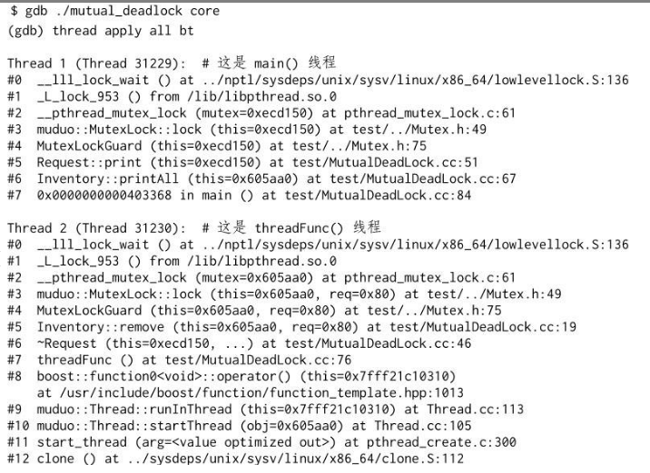

目标文件中有什么？    
+ 目标文件中到底存放的是什么？    
+ 源代码在经过编译以后是怎么存储的？    
1.  目标文件从结构上讲，他是已经编译后的可执行文件格式，只是还没有经过链接的过程，其中可能有些符号或者有些地址还没有被调整。其实它本身是按照可执行文件格式存储的，只是跟真正的可执行文件在结构上稍有不同。    
2.  现在PC平台流行的可执行文件的格式：    
    + Windows系统的PE   
    + Linux的ELF    
    他们都是COFF格式的变种，目标文件就是源代码编译后但未进行连接的哪些中间文件。
3.  不光是可执行文件按照可执行文件格式存储。动态链接库、静态链接库文件都是按照可执行文件格式存储。静态链接库稍有各不同，他是把很多目标文件捆绑在一起形成一个文件，再加上一些索引，你可以简单的把它理解为一个包含有很多目标文件的文件包。
				
		在linux下是用file命令来查看相应文件格式：		
		[../pictures/3.jpg](../pictures/3.jpg)		

